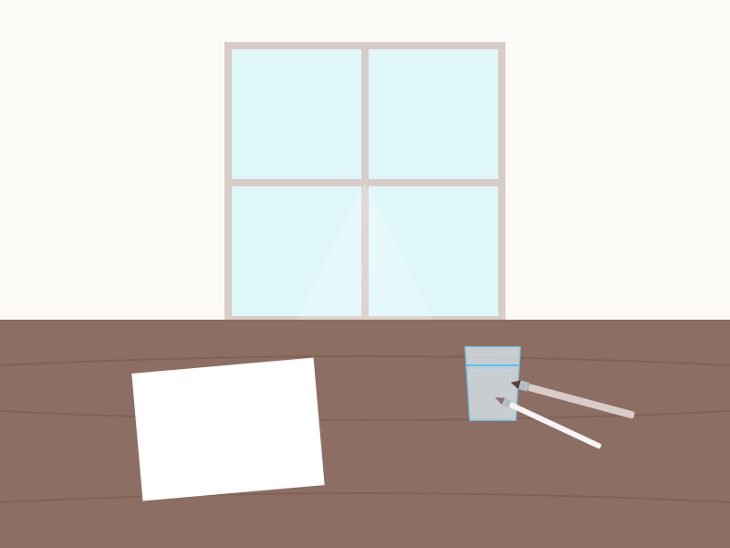

# TEMA 0.1: MI ESPACIO DE PAZ

## SUBTEMA 0.1.1: LA LUZ Y LA MESA

### 1. INTRODUCCIÓN

Para pintar con el alma, necesitamos que el cuerpo esté cómodo. No necesitamos un estudio de artista profesional, solo un rincón amable en nuestra casa.

### 2. LA LUZ: NUESTRA MEJOR AMIGA

La luz nos ayuda a ver los colores como realmente son.

- **Lo ideal**: Luz natural de una ventana. Si eres diestro, busca que la luz venga de la izquierda para que tu mano no haga sombra sobre el papel.
- **Lo evitable**: Luz muy amarilla o muy tenue que nos obligue a forzar la vista.

### 3. LA MESA: EL SUELO FIRME

Tu mesa debe estar despejada. Solo necesitamos espacio para el papel, el agua y las pinturas.

- **Altura correcta**: Que tus hombros estén relajados, no subidos hacia las orejas.
- **El orden**:
  - Si eres **diestro**: Agua y pinturas a la derecha. Papel al centro.
  - Si eres **zurdo**: Agua y pinturas a la izquierda. Papel al centro.
*¿Por qué?* Para no cruzar la mano mojada por encima del dibujo y gotear accidentalmente.

### 4. LA SILLA

Busca una silla con respaldo firme. Si tus pies no llegan al suelo, usa un pequeño banquito o caja para apoyarlos. Pintar es un placer, no un sacrificio para la espalda.

### RESUMEN
>
> "Un lugar ordenado invita a una mente tranquila."

1. Luz natural lateral.
2. Mesa despejada.
3. Materiales del lado de tu mano dominante.
4. Espalda cómoda.
