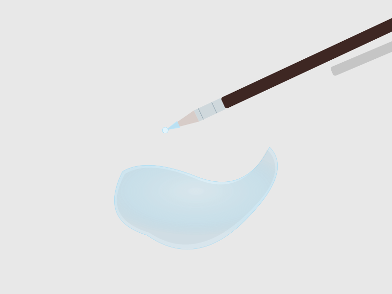

# TEMA 1.1: LA DANZA DEL AGUA

## SUBTEMA 1.1.1: MOJANDO EL PAPEL

### 1. EL MIEDO AL BLANCO

A veces el papel blanco da miedo. Parece tan limpio que no queremos "ensuciarlo". Pero el papel de acuarela está esperando beber agua. ¡Démosle de beber!

### 2. AGUA LIMPIA

Para este primer paso, **NO** usaremos pintura todavía. Solo agua limpia y cristalina.
El agua es invisible, pero cuando toca el papel, lo oscurece un poquito y lo hace brillar.

### 3. EL RASTRO DE HUMEDAD

Imagina que tu pincel es una fregona pequeña.

- Cárgalo de agua limpia.
- Pásalo suavemente por el papel.
- Mueve la cabeza un poco para ver el reflejo de la luz. ¿Ves el camino brillante? Esa es tu pista de baile.

### 4. CANTIDAD JUSTA

- **Inundación**: Si hay un charco grande que se mueve mucho, es demasiada agua. Sécalo un poco con el pincel seco.
- **Desierto**: Si el pincel raspa y no deja brillo, falta agua.

### RESUMEN

1. Solo agua limpia hoy.
2. Pincel cargado, pero no goteando.
3. Busca el brillo en el papel moviendo la cabeza.
