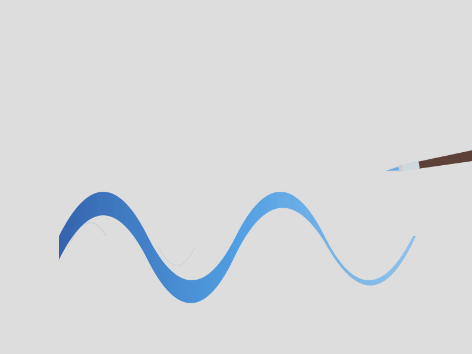

# TEMA 1.2: CAMINOS DE COLOR

## SUBTEMA 1.2.1: LÍNEAS QUE RESPIRAN

### 1. EL PULSO DE LA MANO

Nuestra mano tiene ritmo. Al pintar líneas, no queremos reglas rígidas, queremos cintas que bailan.
El pincel redondo nos permite hacer magia: si apretamos, la línea engorda. Si levantamos, la línea adelgaza.

### 2. RESPIRAR CON EL TRAZO

Intenta esto:

- Toma aire...
- Suelta el aire mientras tu pincel viaja por el papel.
- Cuando se te acabe el aire, levanta el pincel.
Pintar es como cantar en silencio.

### 3. LA PRESIÓN

- **De puntitas**: Solo la punta del pincel toca el papel. Sale una línea fina como un cabello.
- **Talón**: Aplastas la barriga del pincel contra el papel. Sale una línea gorda y jugosa.
- **El Juego**: Empieza fino, aprieta, y levanta suave. Como una hoja de hierba.

### RESUMEN

1. Coordina tu respiración.
2. Juega a apretar y soltar.
3. Líneas finas y líneas gordas, todas son bellas.
