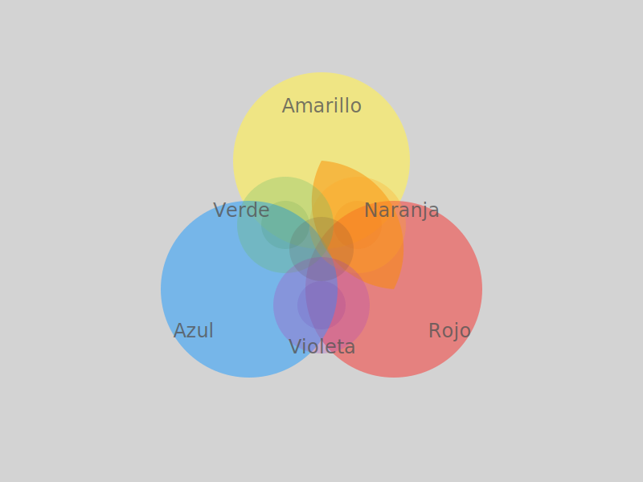

# TEMA 1.2: CAMINOS DE COLOR

## SUBTEMA 1.2.2: MEZCLANDO EN EL PAPEL (COLORES AMIGOS)

### 1. LA MAGIA DEL ENCUENTRO

Normalmente mezclamos colores en una paleta de plástico. Pero es más hermoso dejar que se mezclen solos en el papel.
Cuando dos colores húmedos se tocan, se saludan y crean un tercer color.

### 2. LOS AMIGOS BÁSICOS

- **Amarillo + Azul** = Se convierten en **Verde** (como el pasto).
- **Rojo + Amarillo** = Se convierten en **Naranja** (como el sol).
- **Azul + Rojo** = Se convierten en **Violeta** (como una flor).

### 3. SIN MIEDO AL BARRO

A veces, si mezclamos demasiados colores y refregamos mucho, sale un color marrón feo ("barro").
**El secreto**: Déjalos tocarse y ¡déjalos en paz! No revuelvas el papel como si fuera sopa.

### RESUMEN

1. Pon un color jugoso.
2. Pon otro color al lado, tocándolo.
3. Observa cómo nace el nuevo color en la frontera.
4. No revuelvas mucho.
