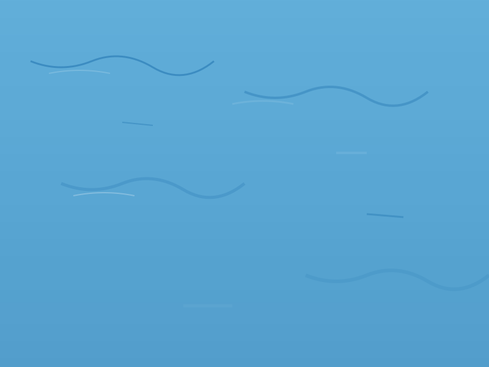

# TEMA 2.2: EL MAR DE LA MEMORIA

## SUBTEMA 2.2.2: OLAS SUAVES (MOVIMIENTO RÍTMICO)

### 1. EL MAR NO ESTÁ QUIETO

El agua del mar respira. Sube y baja.
Para pintar esto, no necesitamos dibujar cada ola. Solo necesitamos sugerir el movimiento.

### 2. TRAZOS CORTOS

Usaremos pinceladas horizontales, cortas y largas intercaladas.
Imagina que estás escribiendo guiones: `_ __ ___ _ __`
Deja espacios pequeños sin pintar entre las pinceladas, para que el brillo del papel parezca la espuma.

### 3. LEJOS Y CERCA

- **Cerca del horizonte**: Las líneas son muy finitas y están muy juntas. Apenas se ven.
- **Cerca de nosotros (abajo)**: Las líneas son más gruesas y separadas. Vemos más detalle.

### RESUMEN

1. Pinceladas horizontales.
2. Deja respirar el blanco (espuma).
3. Arriba pequeñito, abajo grande.
