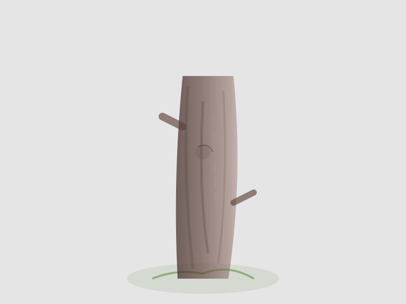

# TEMA 3.1: ÁRBOLES ABUELOS

## SUBTEMA 3.1.1: EL TRONCO FIRME (LÍNEAS VERTICALES)

### 1. NUESTROS MAESTROS ANTIGUOS

Los árboles son como nosotros: tienen raíces, cuerpo y brazos. Han visto pasar el tiempo y siguen de pie.
Pintar un árbol es honrar su fortaleza.

### 2. DE ABAJO HACIA ARRIBA

Los árboles crecen hacia el cielo. Así los pintaremos.

- Pon tu pincel abajo (en la tierra).
- Sube despacio hacia arriba, soltando la presión a medida que llegas a las ramas.
- El tronco es grueso abajo y se afina arriba.

### 3. EL COLOR DE LA TIERRA

Usa marrón. Si tienes dos marrones, mézclalos. La corteza no es de un solo color, tiene sombras y luces.
Deja que el pincel tiemble un poco. Los árboles no son lisos como postes de luz, son rugosos y bellos.

### RESUMEN

1. Pinta de la tierra al cielo.
2. Grueso abajo, fino arriba.
3. El temblor de la mano hace la corteza más real.
