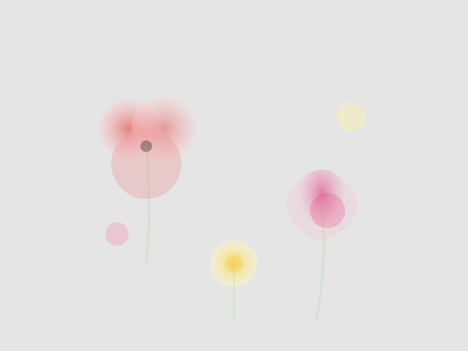

# TEMA 3.2: FLORES SILVESTRES

## SUBTEMA 3.2.1: MANCHAS QUE SON PÉTALOS

### 1. LA BELLEZA IMPERFECTA

Una flor no es un dibujo técnico. Es una explosión de alegría.
En acuarela, una simple "mancha" redonda puede ser una rosa preciosa.

### 2. MENOS ES MÁS

No intentes dibujar pétalo por pétalo.

- Haz tres o cuatro manchitas de color rojo juntas, dejando un huequito blanco en el medio.
- ¡Listo! Tu ojo ya ve una flor.

### 3. EL TALLO

Una línea fina y verde que sale de abajo de la mancha. No necesita ser recta (las flores se mueven).

### RESUMEN

1. Manchas sueltas de color.
2. Deja respirar el centro.
3. Tallo fino y suelto.
4. Confía en que ya parece una flor.
