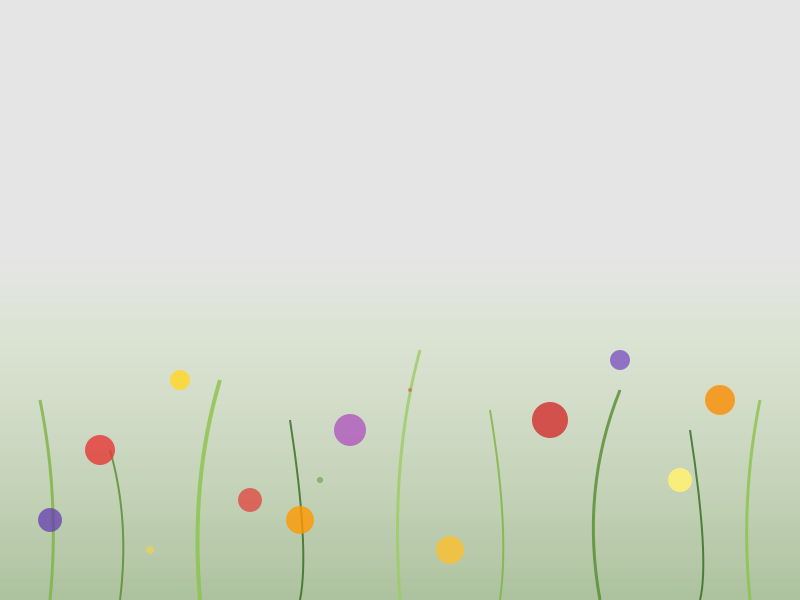

# TEMA 3.2: FLORES SILVESTRES

## SUBTEMA 3.2.2: EL JARDÍN IMAGINARIO (COMPOSICIÓN LIBRE)

### 1. LLENANDO EL ESPACIO

Ya sabemos hacer árboles y flores. Ahora vamos a juntarlos.
Imagina un lugar donde te gustaría descansar.
¿Hay muchos árboles o solo uno? ¿Hay flores rojas o azules?
En tu papel eres tú quien decide.

### 2. PRIMERO Y SEGUNDO PLANO

- **Cerca (abajo)**: Pinta las flores más grandes y detalladas.
- **Lejos (arriba)**: Haz manchas más pequeñitas y suaves. Eso da sensación de distancia.

### 3. LA ATMÓSFERA

No te olvides del suelo.
Con un verde muy aguado (mucha agua), pinta suavemente debajo de tus flores para unirlas todas. Que no floten en el aire.

### RESUMEN

1. Tú eres el jardinero.
2. Grandes abajo, pequeños arriba.
3. Un suelo suave para unirlas.
