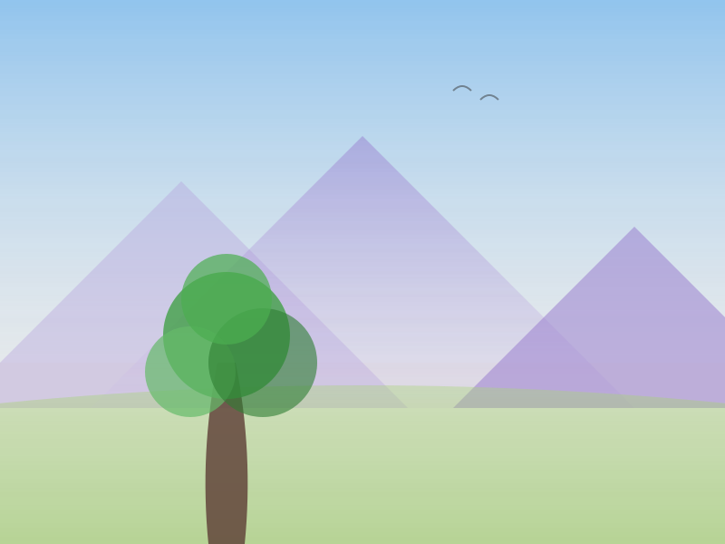

# TEMA 4.1: COMPONIENDO MI PAISAJE

## SUBTEMA 4.1.1: EL FONDO Y LA FORMA (UNIR CIELO Y TIERRA)

### 1. LA HISTORIA COMPLETA

Hoy vamos a juntar todo lo aprendido.
Vamos a pintar un paisaje completo donde el cielo conversa con la tierra.
No tengas miedo, ya conoces cada parte por separado.

### 2. EL ORDEN MÁGICO

Para que no se nos mezclen los colores feos, seguiremos este orden:

1. **El Cielo**: Píntalo primero y déjalo secar. (Recuerda las nubes).
2. **La Tierra (o el Mar)**: Pinta la base de abajo.
3. **Los Detalles**: Al final, cuando todo esté seco, pinta el árbol o las flores encima.

### 3. LA PERSPECTIVA SIMPLE

Para que se vea profundo:

- Pinta el cielo más claro abajo (cerca del horizonte).
- Pinta la tierra más oscura abajo (cerca de ti).

### RESUMEN

1. Primero el cielo (lejos).
2. Espera que seque.
3. Luego la tierra.
4. Al final los detalles (cerca).
