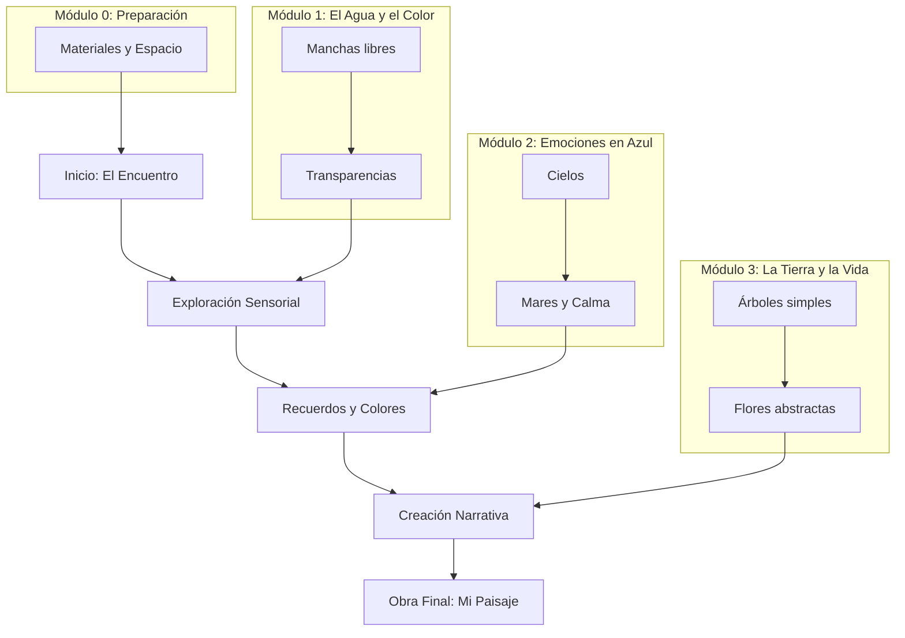

# ARQUITECTURA CURRICULAR: PINTURA CON ACUARELA Y NARRATIVA "COLORES PARA EL ALMA"

## METADATA

- **Complejidad**: Muy Baja (Terapéutica/Recreativa)
- **Duración estimada**: 10 Horas (Diseñado en micro-sesiones de 20 min)
- **Audiencia objetivo**: Adultos mayores (90 años). Interés en arte/relajación. Lectura pausada.
- **Prerrequisitos obligatorios**:
  1. Papel (básico o de acuarela)
  2. Pinceles (suaves y fáciles de agarrar)
  3. Acuarelas (pastilla o tubo)
  4. Agua y paño
- **Fecha de diseño**: 2025-12-18

## MAPA CONCEPTUAL



## OBJETIVOS GENERALES DEL CURSO

1. **Disfrute Sensorial**: Experimentar el placer táctil y visual de mezclar agua y color, reduciendo la ansiedad.
2. **Motricidad Fina**: Ejercitar suavemente la coordinación mano-ojo a través de pinceladas libres y controladas.
3. **Expresión Emocional**: Conectar los colores y las formas con recuerdos positivos y sensaciones de calma.
4. **Narrativa Personal**: Acompañar cada trazo con una historia o reflexión breve que estimule la memoria y el alma.

## ESTRUCTURA MODULAR

### MÓDULO 0: Preparación del Nido Creativo

**Duración**: 1 Hora
**Objetivo**: Preparar el entorno físico y mental para pintar sin estrés ni incomodidad.

#### TEMA 0.1: Mi Espacio de Paz

- **Subtema 0.1.1**: La Luz y la Mesa (Comodidad visual y postural)
- **Subtema 0.1.2**: Mis Herramientas (Conociendo los pinceles y el papel)

---

### MÓDULO 1: El Romance del Agua y el Color

**Duración**: 2 Horas
**Objetivo**: Perder el miedo a la hoja en blanco jugando con la fluidez.

#### TEMA 1.1: La Danza del Agua

- **Subtema 1.1.1**: Mojando el papel (Sentir la humedad)
- **Subtema 1.1.2**: La Gota de Color (Observar la expansión)

#### TEMA 1.2: Caminos de Color

- **Subtema 1.2.1**: Líneas que respiran (Pinceladas suaves)
- **Subtema 1.2.2**: Mezclando en el papel (Colores amigos)

---

### MÓDULO 2: Recuerdos en Azul (Cielos y Aguas)

**Duración**: 2.5 Horas
**Objetivo**: Evocar calma y serenidad pintando elementos inmensos y amables.

#### TEMA 2.1: Mirando al Cielo

- **Subtema 2.1.1**: El Azul de la Mañana (Lavado plano suave)
- **Subtema 2.1.2**: Nubes Pasajeras (Respetando el blanco)

#### TEMA 2.2: El Mar de la Memoria

- **Subtema 2.2.1**: El Horizonte (Línea de calma)
- **Subtema 2.2.2**: Olas Suaves (Movimiento rítmico)

---

### MÓDULO 3: El Abrazo de la Tierra (Naturaleza)

**Duración**: 2.5 Horas
**Objetivo**: Conectar con la vitalidad y la fuerza a través de verdes y marrones.

#### TEMA 3.1: Árboles Abuelos

- **Subtema 3.1.1**: El Tronco Firme (Líneas verticales)
- **Subtema 3.1.2**: Hojas al Viento (Punteado libre)

#### TEMA 3.2: Flores Silvestres

- **Subtema 3.2.1**: Manchas que son pétalos
- **Subtema 3.2.2**: El Jardín Imaginario

---

### MÓDULO 4: Mi Historia en Colores (Proyecto Integrador)

**Duración**: 2 Horas
**Objetivo**: Crear una pequeña obra completa que cuente una sensación o recuerdo.

#### TEMA 4.1: Componiendo mi Paisaje

- **Subtema 4.1.1**: El fondo y la forma (Unir cielo y tierra)
- **Subtema 4.1.2**: La Firma del Autor (Valorar mi obra)

## RECURSOS TÉCNICOS REQUERIDOS

### Para el estudiante

- Papel de acuarela (o cartulina gruesa blanca)
- Pincel redondo (tamaño 8 o 10, mango grueso si es posible para mejor agarre)
- Acuarelas escolares o profesionales
- Dos frascos con agua
- Paño o servilleta

### Para el instructor/plataforma

- Letra Grande y Clara (Sans Serif, alto contraste)
- Audio pausado y amable
- Imágenes de referencia grandes y sencillas

## MATRIZ DE TRAZABILIDAD

| Módulo    | Conceptos   | Objetivos    | Evaluaciones     | Tiempo (h) |
| --------- | ----------- | ------------ | ---------------- | ---------- |
| 0         | Entorno     | Preparar     | Lista de Chequeo | 1          |
| 1         | Agua/Color  | Experimentar | Ejercicio Libre  | 2          |
| 2         | Azul/Calma  | Evocar       | Pintura Guiada   | 2.5        |
| 3         | Tierra/Vida | Conectar     | Pintura Guiada   | 2.5        |
| 4         | Obra Final  | Integrar     | Galería Personal | 2          |
| **TOTAL** | **4**       | **-**        | **5**            | **10**     |

## JSON ARBOL CURRICULAR

```json
[
  {
    "modulo_id": 0,
    "titulo": "Preparación del Nido Creativo",
    "temas": [
      {
        "tema_id": "0.1",
        "titulo": "Mi Espacio de Paz",
        "subtemas": [
          {
            "subtema_id": "0.1.1",
            "titulo": "La Luz y la Mesa"
          },
          {
            "subtema_id": "0.1.2",
            "titulo": "Mis Herramientas"
          }
        ]
      }
    ]
  },
  {
    "modulo_id": 1,
    "titulo": "El Romance del Agua y el Color",
    "temas": [
      {
        "tema_id": "1.1",
        "titulo": "La Danza del Agua",
        "subtemas": [
          {
            "subtema_id": "1.1.1",
            "titulo": "Mojando el papel"
          },
          {
            "subtema_id": "1.1.2",
            "titulo": "La Gota de Color"
          }
        ]
      },
      {
        "tema_id": "1.2",
        "titulo": "Caminos de Color",
        "subtemas": [
          {
            "subtema_id": "1.2.1",
            "titulo": "Líneas que respiran"
          },
          {
            "subtema_id": "1.2.2",
            "titulo": "Mezclando en el papel"
          }
        ]
      }
    ]
  },
  {
    "modulo_id": 2,
    "titulo": "Recuerdos en Azul (Cielos y Aguas)",
    "temas": [
      {
        "tema_id": "2.1",
        "titulo": "Mirando al Cielo",
        "subtemas": [
          {
            "subtema_id": "2.1.1",
            "titulo": "El Azul de la Mañana"
          },
          {
            "subtema_id": "2.1.2",
            "titulo": "Nubes Pasajeras"
          }
        ]
      },
      {
        "tema_id": "2.2",
        "titulo": "El Mar de la Memoria",
        "subtemas": [
          {
            "subtema_id": "2.2.1",
            "titulo": "El Horizonte"
          },
          {
            "subtema_id": "2.2.2",
            "titulo": "Olas Suaves"
          }
        ]
      }
    ]
  },
  {
    "modulo_id": 3,
    "titulo": "El Abrazo de la Tierra (Naturaleza)",
    "temas": [
      {
        "tema_id": "3.1",
        "titulo": "Árboles Abuelos",
        "subtemas": [
          {
            "subtema_id": "3.1.1",
            "titulo": "El Tronco Firme"
          },
          {
            "subtema_id": "3.1.2",
            "titulo": "Hojas al Viento"
          }
        ]
      },
      {
        "tema_id": "3.2",
        "titulo": "Flores Silvestres",
        "subtemas": [
          {
            "subtema_id": "3.2.1",
            "titulo": "Manchas que son pétalos"
          },
          {
            "subtema_id": "3.2.2",
            "titulo": "El Jardín Imaginario"
          }
        ]
      }
    ]
  },
  {
    "modulo_id": 4,
    "titulo": "Mi Historia en Colores (Proyecto Integrador)",
    "temas": [
      {
        "tema_id": "4.1",
        "titulo": "Componiendo mi Paisaje",
        "subtemas": [
          {
            "subtema_id": "4.1.1",
            "titulo": "El fondo y la forma"
          },
          {
            "subtema_id": "4.1.2",
            "titulo": "La Firma del Autor"
          }
        ]
      }
    ]
  }
]
```
